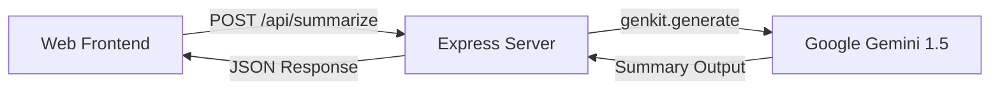

# Project Architecture

This document describes the high-level architecture of the **Summarize-A-Video AI** application.

## 🏗️ System Overview

The application follows a standard Client-Server architecture, leveraging Cloud-native AI services for processing.

## 📂 Component Breakdown

### 1. Frontend (`/public`)
- **HTML5/CSS3**: Provides a premium dark-mode interface with glassmorphism elements.
- **JavaScript**: Handles file uploads, URL validation, and real-time UI updates during processing.

### 2. Backend (`/src`)
- **Express Server (`index.ts`)**: The core entry point. Handles routing, rate limiting, and security headers.
- **AI Integration**: Uses **Firebase Genkit** to orchestrate interactions with the **Google Gemini API**. It abstracts the complexity of prompt engineering and media handling.

### 3. AI Layer
- **Google Gemini 1.5 Flash/Pro**: The engine that processes video input. It performs multi-modal analysis (video + audio) to generate accurate summaries based on the user's prompt.

## 🛠️ Key Technologies
- **Genkit**: Provides a structured way to build AI flows.
- **TypeScript**: Ensures type safety across the backend logic.
- **Rate Limiting**: Protects the API from abuse and ensures stability.
